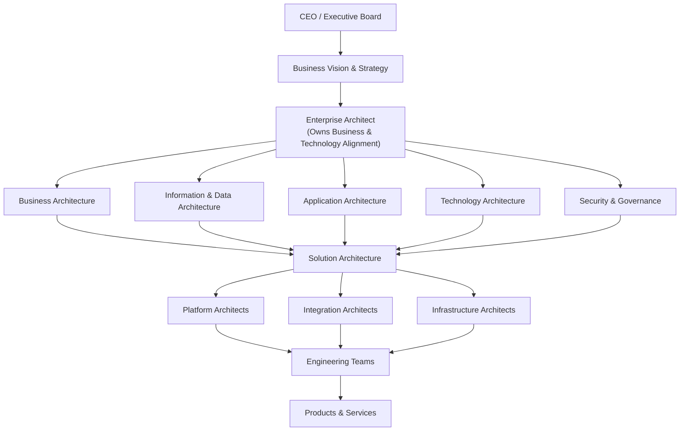

# Enterprise-architecture
What is Enterprise Architect? Why Enterprise Architect required?

## Definition
Enterprise Architecture is the practice of aligning an organization's business strategy with its information, applications, data, and technology. An Enterprise Architect works with business leaders and domain architects to define standards, roadmaps, governance, and target architectures that enable the organization to achieve its strategic goals efficiently, securely, and sustainably.

## Knowledge Logical Architecture of Enterprise-Architect responsibility
                        # Enterprise Architect Responsibility Model

